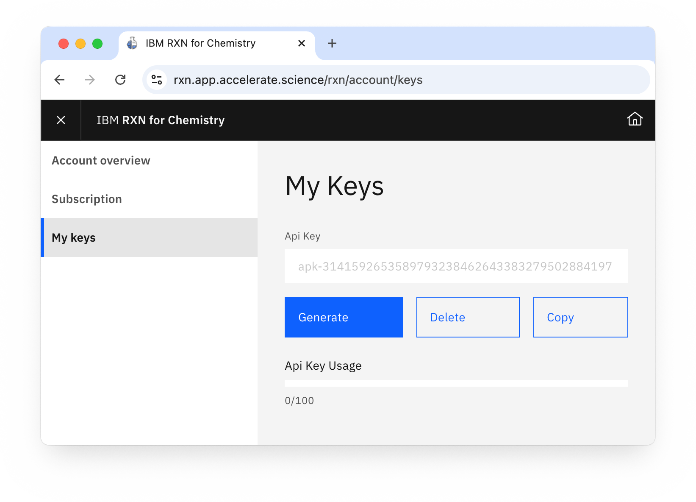

# OpenAD Plugin - RXN

_This is a plugin for [OpenAD](https://github.com/acceleratedscience/open-ad-toolkit)_

 

## About RXN

RXN helps you predict chemical reactions, retrosynthesis pathways and experimental procedures.

RXN was trained on more than 3 million chemical reactions, derived from publicly available patents. Since then, the Molecular Transformer has outperformed all data-driven models, achieving more than 90% accuracy on forward chemical reaction predictions (reactants + reagents to products).

You can train AI models with data for specific chemistry domains.

[rxn.app.accelerate.science](https://rxn.app.accelerate.science) / [GitHub](https://github.com/rxn4chemistry)

 

## About this Plugin

This plugin exposes a subset of RXN functionality to the OpenAD client, more specifically:
- Predict reactions between molecules
- Predict retrosynthesis pathways to generate a molecule
- Interpret chemical recipes and parse them into step-by-step instructions

 

## Installation

Regular installation:

    pip install git+https://github.com/acceleratedscience/openad-plugin-rxn

Installation for development:

    git clone git@github.com:acceleratedscience/openad-plugin-rxn.git
    cd openad-plugin-rxn
    pip install -e .

 

## Authentication

In order to use this plugin, you need an API key. You'll get 100 API request for free.

1. Sign up for an RXN account at [rxn.app.accelerate.science](https://rxn.app.accelerate.science)
2. Obtain your API key by clicking the user profile icon in the top right hand corner and select "Account", then select the "My keys" tab.
    
    

3. Use any RXN command to be prompted for your credentials.

    - **Hostname:** (Enter blank for default - [https://rxn.app.accelerate.science](https://rxn.app.accelerate.science))
    - **API_key:** Your API key

    You should get a message saying you successfully logged in.
    
    To reset your credentials, run `rxn reset login`